## Actividades evaluables.
#### 1. Script que muestre el mensaje Hola Mundo entrecomillado.
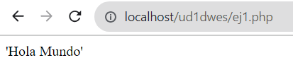
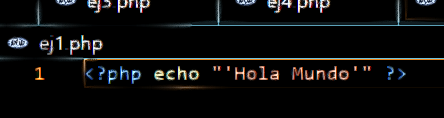
#### 2. Ficha personal con los datos cargados en variables. El resultado debe mostrar una foto personal.
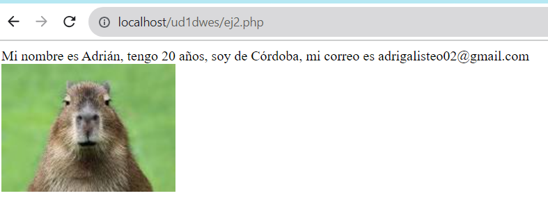
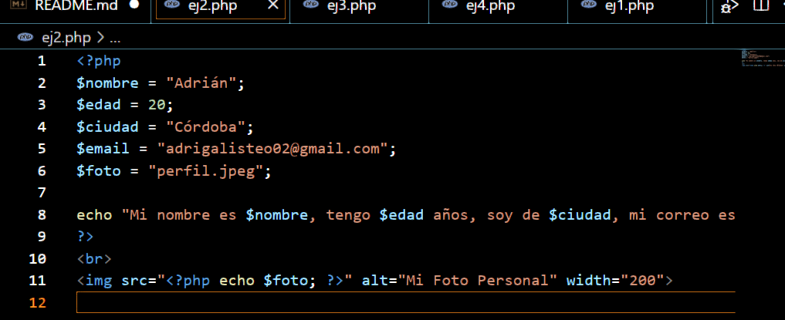

#### 3. Script que, a partir del radio almacenado en una variable y la definición de la constante PI, calcule el área del círculo y la longitud de la circunferencia. El debe mostrar valor de radio, longitud de la circunferencia, área del círculo y dibujará un círculo utilizando gráficos vectoriales.

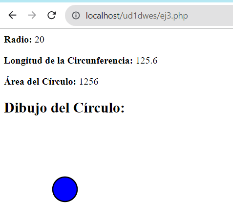
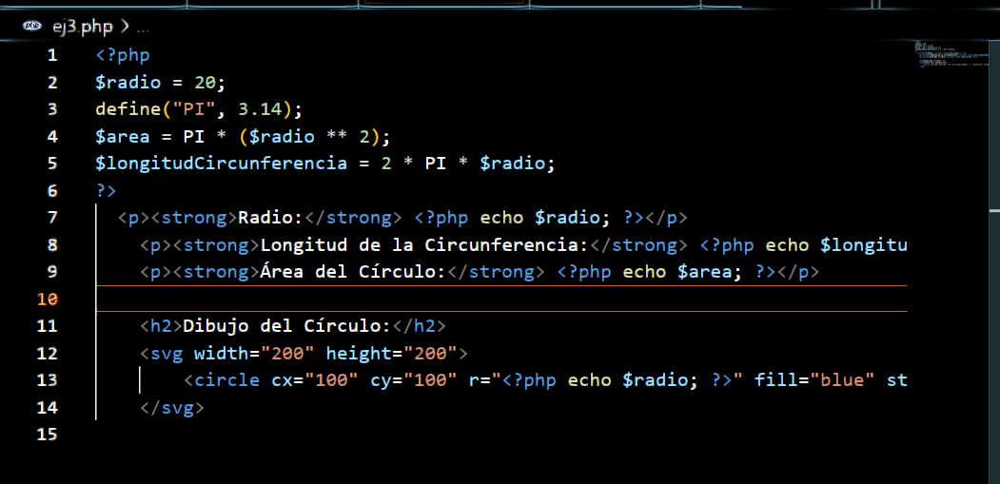

#### 4. ¿Cuál es la salida del siguiente script?
La salida es: DWES es un módulo de 2 curso de DAW

Prueba el script y modifícalo para las palabras DAW y DWES apararezcan en negrita.

Investiga uso de print y printf para salida de texto.
El print muestra texto mientras  printf controla el formato dado

Fuente:https://guidacode.com/2017/php/como-formato-strings-printf-de-php/
#### 5. Script que escriba el resultado de la suma de dos números almacenados en dos variables.
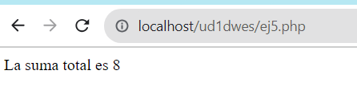

#### 6. Script que cargue las siguientes variables:
$x=10;
$y=7;
y muestre
10 + 7 = 17
10 - 7 = 3
10 * 7 = 70
10 / 7 = 1.4285714285714
10 % 7 = 3

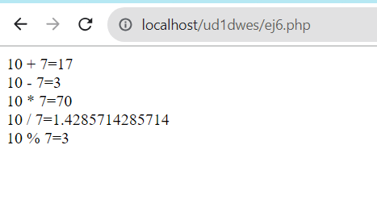

#### 7. Escribir un script que declare una variable y muestre la siguiente información en pantalla:
Valor actual 8.
Suma 2. Valor ahora 10.
Resta 4. Valor ahora 6.
Multipica por 5. Valor ahora 30.
Divide por 3. Valor ahora 10.
Incrementa el valor en 1. Valor ahora 11.
Decrementa el valor en 1. Valor ahora 11.
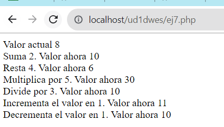

#### 8. A veces es necesario conocer exactamente el contenido de una variable. Piensa como puedes hacer esto y escribe un script con la siguiente salida:
string(5) “Harry”
Harry
int(28)
NULL
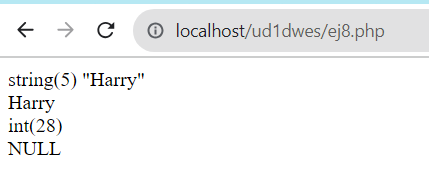

#### 9. Escribir un script que utilizando variables permita obtener el siguiente resultado:
Valor es string.
Valor es double.
Valor es boolean.
Valor es integer.
Valor is NULL.
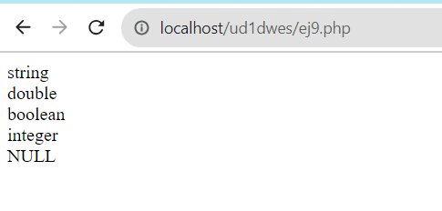

#### 10.Pon ejemplo de uso de la sintaxis heredoc en el manejo de cadenas.
Se usa cuando quieres almacenar varios párrafos en una sola variable sin necesidad de escapar texto.    
Fuente: https://diego.com.es/heredoc-y-nowdoc-en-php
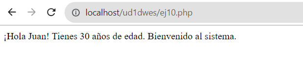